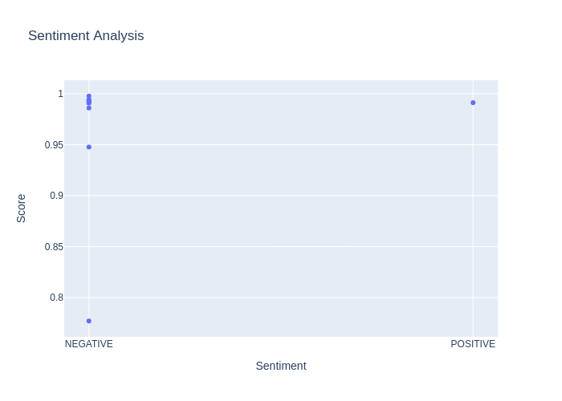

# Web scraping and sentiment analysis

This repo is structured in four modules or components:
- ```Scraping https://www.aljazeera.com/where/mozambique/ to get 10 most recent articles from the website```
- ```Pre-processing the data```
-  ```Performing sentiement analysis```
-   ``` Visualizing the results```

## Installation

For conda:
```shell
conda env create -n minds_env --file environment.yml
conda activate minds_env
```

For pypi:
```shell
pip install -r requirements.txt
```
(This was tested on `python 3.10.4`)

## Scraping the webiste

The entire repository has used python and associated libraries. To access the given URL and to get the contents of the URL


## Run
```shell
python -m src.engine
```

## Results


